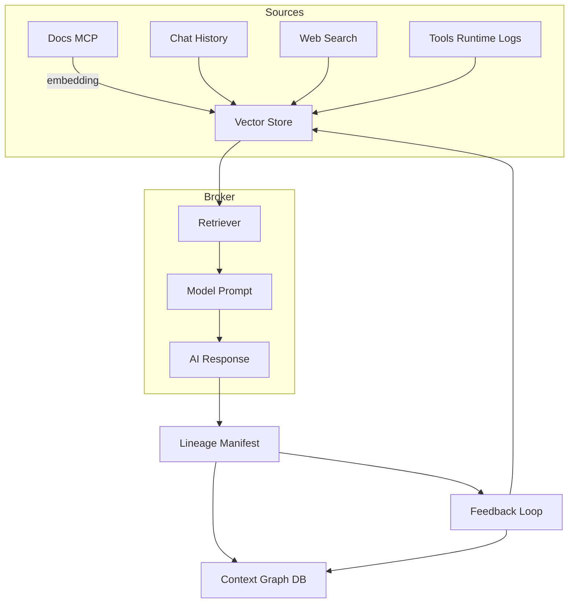

# AI Context Provenance & Evolution Framework

## Overview

The goal is to **trace AI context** — to understand where an AI’s reasoning and responses originate, how different sources contribute, and how that context evolves over time. This enables auditability, improvement, and explainability of model behavior.

---

## 1. Define Context Units

**Context Units (CUs)** represent the smallest traceable pieces of information used to generate a response.  
Each CU has type, source, and metadata for provenance tracking.

| Type | Example | Source |
|------|----------|--------|
| **System context** | tool definitions, MCP plugins, active namespaces | Runtime |
| **User context** | chat history, project data, docs in memory | Stored embeddings / memory |
| **External context** | web results, MCP tool outputs | External integrations |
| **Model state context** | temperature, system prompt, active agent goals | Agent orchestration layer |

Example CU:
```json
{
  "type": "memory",
  "source": "project:ripple/platform-engineering",
  "timestamp": "2025-10-09T16:15:00Z",
  "contribution": 0.34,
  "embedding_id": "vec_3928a",
  "summary": "describes ArgoCD AppSets with SCM filtering"
}
```

---

## 2. Context Lineage Tracking

Each AI response includes a **lineage manifest**, similar to data lineage in analytics.

Elements:
- **UUID per response**: `ctx_20251009_00123`
- **Linked contexts**: the Context Units used
- **Provenance tree**: DAG showing combinations and derivations
- **Weights**: degree of influence of each source

Example manifest:
```json
{
  "response_id": "ctx_20251009_00123",
  "context_tree": [
    { "id": "mem:argo.appset", "score": 0.42 },
    { "id": "file:argocd/values.yaml", "score": 0.31 },
    { "id": "tool:docs_mcp", "score": 0.27 }
  ],
  "agent": "claude-sdk:lazy-broker",
  "model": "claude-3.5-sonnet",
  "token_count": 1984
}
```

This makes it possible to trace *which contexts fed each output*, and *how strongly*.

---

## 3. Context Graph / Embedding Store

Store all CUs in a **graph or vector store** with relationship edges:
- `USED_IN → response_id`
- `DERIVED_FROM → memory_id`
- `UPDATED_BY → agent_id`

This allows powerful queries such as:
- “Show all responses influenced by outdated docs.”
- “Which memory embeddings consistently mislead the model?”
- “Trace how the ‘Crossplane provider’ concept evolved over time.”

**Recommended infrastructure:**
- **Graph:** Neo4j or Dgraph
- **Vector:** Weaviate, Milvus, pgvector
- **Hybrid search:** ElasticSearch or Qdrant

---

## 4. Runtime Hooks for Attribution

At runtime (in your AI broker or orchestration layer):

1. Intercept every **retrieval** and tag context IDs.
2. Intercept each **tool or memory access**.
3. Log mapping of *prompt → context → final answer*.
4. Persist all lineage data to a **versioned ledger** (e.g., SQLite, Redis Stream, or S3).

**Example debug command:**
```
/trace ctx_20251009_00123
```

Output (visual tree):
```
response
 ├── memory: project_notes.md (0.45)
 ├── mcp: docs-server query "argo appsets" (0.33)
 └── web: https://argo-cd.readthedocs.io (0.22)
```

---

## 5. Feedback & Context Evolution

Once you can trace context, you can *improve it continuously*:

- **Human feedback:** associate ratings with contributing CUs.
- **Decay/boost:** adjust embedding weights over time.
- **Retraining signals:** use lineage manifests as fine-tuning data.
- **Semantic diffs:** track how concepts change across context versions.

---

## 6. Tooling Recommendations

| Function | Suggested Tools / Frameworks |
|-----------|------------------------------|
| Vector + Metadata | Weaviate, LanceDB, pgvector |
| Provenance Graph | Neo4j, TerminusDB, DVC metadata |
| Broker / Orchestrator | Claude SDK, LangGraph, Semantic Kernel, MCP |
| Audit Log / Tracing | OpenTelemetry traces + structured JSON logs |
| Visualization | Grafana, Observable, Streamlit lineage viewer |

---

## 7. Example Architecture (Mermaid)



---

## 8. Benefits

- **Transparency:** Clear mapping of reasoning sources.
- **Auditability:** Reconstruct which contexts influenced an answer.
- **Improvement:** Identify weak or misleading memory.
- **Versioning:** Capture how understanding evolves.
- **Explainability:** Show users *why* a model answered as it did.

---

## 9. Next Steps

1. Implement a minimal **context manifest logger** inside your MCP or SDK agent.
2. Extend your embedding pipeline to produce unique IDs per context item.
3. Build a **/trace** CLI or UI view for developers.
4. Add **feedback propagation** from evaluations to context weights.
5. Integrate the lineage graph into your model retraining or summarization loop.

---

*Drafted: October 2025*  
*Author: Zach Taylor / GPT-5 assistant*
